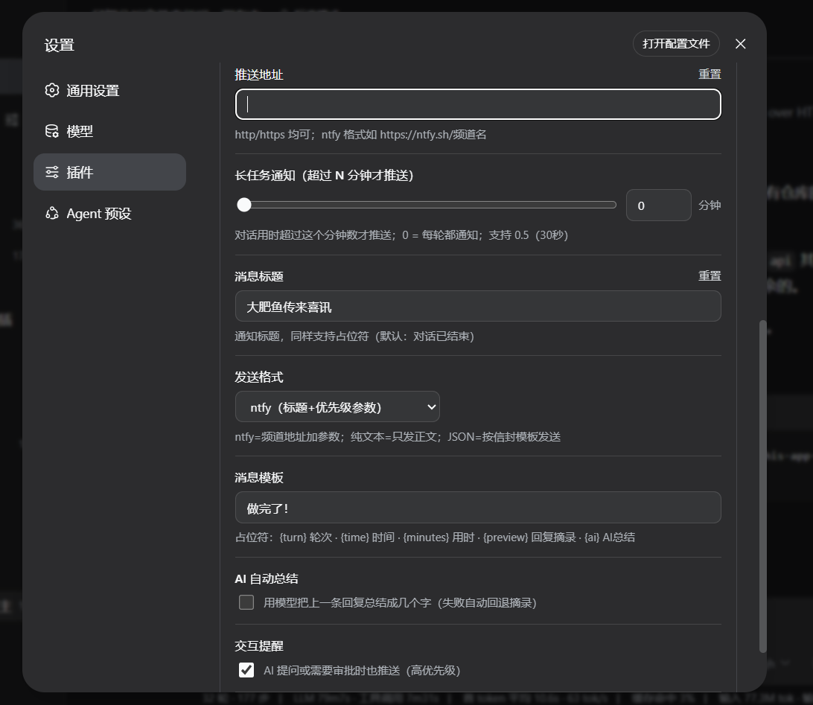

# band-notify · DSH 完成提醒插件

对话轮次结束时，自动向 **ntfy / 任意 webhook** 推送通知（如小米手环、手机、Bark、Telegram、公司内网…）。

- 常驻宿主插件：重启不丢，跨会话生效
- 输入栏铃铛开关：一键开/关
- WebUI 插件配置卡：全部设置可视化，持久化到 `settings.yaml`
- 消息模板 + AI 自动总结 + 多种发送格式

## 功能特性

| 能力 | 说明 |
|---|---|
| 🔔 输入栏铃铛 | 输入框左端小铃铛，点击开/关，颜色区分状态 |
| ⏱ 长任务阈值 | 滑块（不均匀档位 0 / 0.5 / 1 / 2 / 3 / 5 / … / 240 分钟）+ 数字输入，对话用时超过才推送 |
| ✏️ 消息模板 | 标题与正文均可用占位符：`{turn}` 轮次 · `{time}` 时间 · `{minutes}` 用时 · `{preview}` 回复摘录 · `{ai}` AI 总结 |
| 🤖 AI 总结 | 开启后取上一条回复，调模型总结成几个字填入 `{ai}`（失败自动回退摘录） |
| 📮 发送格式 | `ntfy`（标题+优先级参数）／`纯文本`／`自定义 JSON`（信封模板 `{title}` `{body}` `{priority}`，适配 Bark/Telegram/Discord 等） |
| 💾 配置持久化 | 标准 settings 命名空间（`settings.yaml` 的 `band-notify:` 段），与官方插件同机制 |
| 🩺 心跳日志 | 每次触发写日志，便于排查 |

## 界面预览

在 WebUI 输入框左端有铃铛按钮：点击「🔔（开）↔ 🔕（关）」切换是否推送；设置页有插件配置卡，所有项可视化保存。

| 输入栏铃铛 · 开启 | 输入栏铃铛 · 关闭 | 插件配置卡 |
|---|---|---|
|  |  |  |

## 让手环 / 手机收到提醒（新手第一步）

插件只是"发出通知"，手环/手机要收到，需要手机端配合，共三步：

1. **手机装 ntfy App**（安卓/苹果都支持）：
   - 应用商店 / F-Droid 搜 **ntfy** 安装
   - 打开 App → 右上角 **+** 订阅频道，输入你插件里配置的**同一个频道名**（如 `https://ntfy.sh/你的频道` 中的频道名），订阅即可
2. **在手机系统里放行 ntfy 通知**（关键，容易被漏掉）：
   - **安卓**：设置 → 应用 → ntfy → 通知 → 允许（确保"横幅/悬浮通知"开启）
   - **iOS**：设置 → 通知 → ntfy → 允许通知
3. **小米运动健康（小米手环等穿戴设备）联动**：
   - 打开 **小米运动健康** App → 我的 → 设置 → **通知提醒**（消息通知设置）
   - 确保 **ntfy** 处于"允许"状态；这样手机弹 ntfy 通知的同时，手环会跟着震动
   - （不同系统/版本入口位置略有差异，找"通知"或"应用通知管理"即可）

> 💡 先按 [#使用](#使用) 的发送工具发一条测试，手机亮了 → 手环震了 → 大赢鲸的完成提醒就全链路通了。

## 目录结构

```
band-notify-plugin/
├── plugin/                  # 插件本体（宿主 + 浏览器端 + 包定义）
│   ├── index.js             # 宿主：事件监听 → 模板渲染 → 发送
│   ├── client.js            # 浏览器端：铃铛 + 插件配置卡（__ModuleLoader__ 格式）
│   └── package.json         # 包定义（dsh.client 声明）
├── script/
│   └── ntfy_push_test.js    # 独立发送工具（命令行/环境变量）
├── docs/screenshots/        # 界面预览截图（铃铛开/关、配置卡）
├── DEVELOPMENT.md           # DSH 插件开发规范指引（官方文档 + 社区资源 + 参考实现）
├── config.example.json      # 配置示例（复制改名为你的配置）
└── README.md
```

> 想开发自己的 DSH 插件？看 [DEVELOPMENT.md](DEVELOPMENT.md)——官方规范索引、社区教程、以及本插件的实现要点。

## 安装

### 方式一：`dsh plugin`（官方方式，需 pnpm）

> `dsh plugin` 把参数转发给 profile 目录里的 pnpm，装完后若包声明了 `dsh.bundle`，会自动把它加入 profile 的 bundle 层（本插件已声明 `dsh.bundle.patch`，补丁层自带插件行，无需手改 `cordis.patch.yml`）。

```powershell
# 先装 pnpm（一次即可）
npm install -g pnpm

# 本地路径安装（未发布 npm 时，路径换成你的 plugin 目录）
dsh plugin --profile web add "file:F:\路径\band-notify-plugin\plugin"

# npm 发布后即可直接按包名安装
# dsh plugin --profile web add band-notify

# 或从 git 安装
# dsh plugin --profile web add git+ssh://git@ssh.github.com:443/Lichen455/band-notify.git
```

> ⚠️ 开发机保留真实配置时，可继续用方式二指向运行副本；`dsh plugin` 适合全新环境 / 其它机器。

### 方式二：手动安装（无需 pnpm）

前置：DSH（DeepSeek Harness）Web 版，`$DSH_HOME` 即 `~/.dsh`。

1. **拷贝插件**到你的 profile 目录：

   ```powershell
   # Windows 示例（Linux 同理替换路径）
   Copy-Item plugin -Destination "$HOME\.dsh\profiles\web\band-notify" -Recurse
   ```

2. **建两个 junction**（loader 解析与浏览器模块扫描各需一个）：

   ```powershell
   New-Item -ItemType Junction -Path "$HOME\.dsh\profiles\node_modules\band-notify" -Target "$HOME\.dsh\profiles\web\band-notify" -Force
   New-Item -ItemType Junction -Path "<你的node全局模块目录>\band-notify" -Target "$HOME\.dsh\profiles\web\band-notify" -Force
   ```
   （第二个 junction 的目录要能被 harness 的 Node 解析到，例如 `D:\nodejs\node_modules`。）

3. **补丁行**：编辑 `$DSH_HOME\profiles\web\cordis.patch.yml`，追加：

   ```yaml
   - insert:
       - id: band-notify
         name: band-notify
         inject: [subprocess, webServer]
   ```

4. **重启 DSH**。输入栏出现铃铛；设置 → 插件配置 出现「完成提醒」卡片。

> 插件内若硬编码了本机路径（`D:\nodejs\node.exe`、`process.cwd()` 等），请按你的环境调整 `plugin/index.js` 中的 `SENDER`/`cwd`。

## 配置

配置存于 `settings.yaml` 的 `band-notify:` 段（也可直接在 WebUI 插件配置卡里改）：

```yaml
band-notify:
  enabled: true          # 总开关
  minMinutes: 0          # 长任务阈值（分钟，支持 0.5；0=每轮都通知）
  endpoint: https://ntfy.sh/你的频道   # 推送地址
  template: 第 {turn} 轮对话已完成 ({time}) · 用时 {minutes} 分钟   # 正文模板
  titleTemplate: 对话已结束            # 标题模板
  format: ntfy           # ntfy | text | json
  jsonTemplate: '{"title":"{title}","body":"{body}"}'   # format=json 时的信封模板
  aiSummary: false       # AI 自动总结
```

## 使用

- **发送工具**（不依赖 DSH）：

  ```bash
  node script/ntfy_push_test.js "标题" "正文" 4 你的频道
  # 或
  NTFY_TITLE="标题" NTFY_BODY="正文" NTFY_PRIORITY=4 NTFY_TOPIC=你的频道 node script/ntfy_push_test.js
  ```

- **ntfy 通用发布**（任何终端）：

  ```bash
  curl -H "Title: 标题" -d "正文" https://ntfy.sh/你的频道
  ```

## 常见问题

- **通知显示成一坨 JSON**：发送格式与端点不匹配。ntfy 用 `ntfy` 格式；其它 JSON 接口用 `json` + 信封模板。
- **重启后铃铛消失**：确认补丁行存在且 junction 有效；检查宿主日志。
- **AI 总结不生效**：需配置了可用的模型路由（`agent-default-model`/`llm-pi-ai`），失败会自动回退为摘录。

## 安全提示

- ntfy 公共服务器上的消息公开可见，**勿发隐私**；要私密请自托管。
- 仓库内**不要提交真实配置**（频道名/令牌），用 `config.example.json` 模板。

## 许可

MIT
